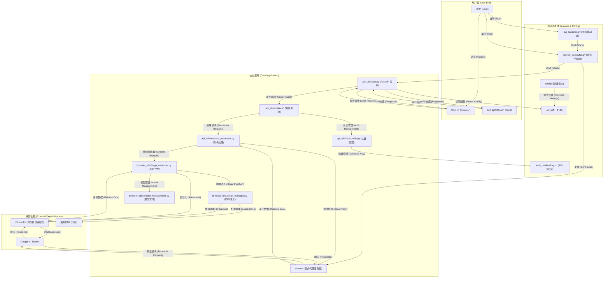

# AI Studio Proxy API

这是一个基于 Python 的代理服务器，用于将 Google AI Studio 的网页界面转换为 OpenAI 兼容的 API。通过 Camoufox (反指纹检测的 Firefox) 和 Playwright 自动化，提供稳定的 API 访问。

[](https://www.star-history.com/#CJackHwang/AIstudioProxyAPI&Date)

This project is generously sponsored by ZMTO. Visit their website: [https://zmto.com/](https://zmto.com/)

本项目由 ZMTO 慷慨赞助服务器支持。访问他们的网站：[https://zmto.com/](https://zmto.com/)

---

## 致谢 (Acknowledgements)

本项目的诞生与发展，离不开以下个人、组织和社区的慷慨支持与智慧贡献：

- **项目发起与主要开发**: @CJackHwang ([https://github.com/CJackHwang](https://github.com/CJackHwang))
- **功能完善、页面操作优化思路贡献**: @ayuayue ([https://github.com/ayuayue](https://github.com/ayuayue))
- **实时流式功能优化与完善**: @luispater ([https://github.com/luispater](https://github.com/luispater))
- **3400+行主文件项目重构伟大贡献**: @yattin (Holt) ([https://github.com/yattin](https://github.com/yattin))
- **项目后期高质量维护**: @Louie （[https://github.com/NikkeTryHard](https://github.com/NikkeTryHard)）
- **社区支持与灵感碰撞**: 特别感谢 [Linux.do 社区](https://linux.do/) 成员们的热烈讨论、宝贵建议和问题反馈，你们的参与是项目前进的重要动力。

同时，我们衷心感谢所有通过提交 Issue、提供建议、分享使用体验、贡献代码修复等方式为本项目默默奉献的每一位朋友。是你们共同的努力，让这个项目变得更好！

---

**这是当前维护的 Python 版本。不再维护的 Javascript 版本请参见 [`deprecated_javascript_version/README.md`](deprecated_javascript_version/README.md)。**

## 📊 兼容性矩阵

| 组件 | 版本要求 | 推荐版本 | 说明 |
|------|---------|---------|------|
| **Python** | ≥3.9, <4.0 | 3.10+ 或 3.11+ | Docker 环境使用 3.10 |
| **操作系统** | Windows / macOS / Linux | - | 完全跨平台支持，Docker 支持 x86_64 和 ARM64 |
| **内存** | ≥2GB | ≥4GB | 浏览器自动化需要 |
| **网络** | 稳定互联网连接 | - | 可配置代理访问 Google AI Studio |
| **依赖管理** | Poetry | 最新版本 | 现代化 Python 依赖管理工具 |
| **类型检查** | Pyright (可选) | 最新版本 | 用于开发时类型检查和 IDE 支持 |


## 系统要求

- **Python**: >=3.9, <4.0 (推荐 3.10+ 以获得最佳性能，Docker 环境使用 3.10)
- **依赖管理**: [Poetry](https://python-poetry.org/) (现代化 Python 依赖管理工具，替代传统 requirements.txt)
- **类型检查**: [Pyright](https://github.com/microsoft/pyright) (可选，用于开发时类型检查和 IDE 支持)
- **操作系统**: Windows, macOS, Linux (完全跨平台支持，Docker 部署支持 x86_64 和 ARM64)
- **内存**: 建议 2GB+ 可用内存 (浏览器自动化需要)
- **网络**: 稳定的互联网连接访问 Google AI Studio (支持代理配置)

## 主要特性

- **OpenAI 兼容 API**: 支持 `/v1/chat/completions` 端点，完全兼容 OpenAI 客户端和第三方工具
- **三层流式响应机制**: 集成流式代理 → 外部 Helper 服务 → Playwright 页面交互的多重保障
- **智能模型切换**: 通过 API 请求中的 `model` 字段动态切换 AI Studio 中的模型
- **完整参数控制**: 支持 `temperature`、`max_output_tokens`、`top_p`、`stop`、`reasoning_effort` 等所有主要参数
- **反指纹检测**: 使用 Camoufox 浏览器降低被检测为自动化脚本的风险
- **脚本注入功能 v3.0**: 使用 Playwright 原生网络拦截，支持油猴脚本动态挂载，100%可靠 🆕
- **现代化 Web UI**: 内置测试界面，支持实时聊天、状态监控、分级 API 密钥管理
- **图形界面启动器**: 提供功能丰富的 GUI 启动器，简化配置和进程管理
- **灵活认证系统**: 支持可选的 API 密钥认证，完全兼容 OpenAI 标准的 Bearer token 格式
- **模块化架构**: 清晰的模块分离设计，api_utils/、browser_utils/、config/ 等独立模块
- **统一配置管理**: 基于 `.env` 文件的统一配置方式，支持环境变量覆盖，Docker 兼容
- **现代化开发工具**: Poetry 依赖管理 + Pyright 类型检查，提供优秀的开发体验

## 系统架构



## 🚀 快速开始

推荐新用户按照 **[快速开始指南](docs/quick-start-guide.md)** 进行部署，预计 15-30 分钟即可完成。

### 三步快速部署

```bash
# 1️⃣ 克隆并安装
git clone https://github.com/CJackHwang/AIstudioProxyAPI.git
cd AIstudioProxyAPI
poetry install  # 自动创建虚拟环境并安装依赖

# 2️⃣ 配置环境
cp .env.example .env
nano .env  # 编辑配置（可选，默认配置即可使用）

# 3️⃣ 首次认证并启动
poetry run python launch_camoufox.py --debug  # 首次认证（需要登录 Google）
# 认证成功后，按 Ctrl+C 停止，然后使用无头模式运行：
poetry run python launch_camoufox.py --headless
```

### 快速测试

```bash
# 健康检查
curl http://127.0.0.1:2048/health

# 获取模型列表
curl http://127.0.0.1:2048/v1/models

# 测试聊天（非流式）
curl -X POST http://127.0.0.1:2048/v1/chat/completions \
  -H "Content-Type: application/json" \
  -d '{"model":"gemini-2.5-pro","messages":[{"role":"user","content":"Hello"}]}'

# 测试流式聊天
curl -X POST http://127.0.0.1:2048/v1/chat/completions \
  -H "Content-Type: application/json" \
  -d '{"model":"gemini-2.5-pro","messages":[{"role":"user","content":"讲个故事"}],"stream":true}' --no-buffer
```

### 访问 Web UI

打开浏览器访问 `http://127.0.0.1:2048/` 使用内置的 Web 聊天界面。

### 进程管理脚本（推荐）

`scripts/start.sh` 与 `scripts/stop.sh` 提供了更可靠的一键启动/停止体验，适合常驻运行：

```bash
./scripts/start.sh   # 启动：自动写 PID、输出到 logs/headless.log
./scripts/stop.sh    # 停止：根据 PID 文件优雅下线
```

`start.sh` 会在启动前自动检测 `2048/3120/9222` 等核心端口，一旦发现同仓库产生的僵尸进程仍占用端口，就发送 SIGTERM/SIGKILL 清理，避免多次运行后端口被卡住的情况；如果端口被其它项目占用则会直接终止并提示手动处理，确保对外部服务安全。

---

## 📦 安装与依赖管理

### 前置要求

- Python 3.9+ (推荐 3.10 或 3.11)
- 2GB+ 可用内存
- 稳定的互联网连接

### 一键安装脚本

**macOS/Linux**:
```bash
curl -sSL https://raw.githubusercontent.com/CJackHwang/AIstudioProxyAPI/main/scripts/install.sh | bash
```

**Windows (PowerShell)**:
```powershell
iwr -useb https://raw.githubusercontent.com/CJackHwang/AIstudioProxyAPI/main/scripts/install.ps1 | iex
```

### 手动安装步骤

#### 1. 安装 Poetry

```bash
# macOS/Linux
curl -sSL https://install.python-poetry.org | python3 -

# Windows (PowerShell)
(Invoke-WebRequest -Uri https://install.python-poetry.org -UseBasicParsing).Content | py -
```

#### 2. 克隆项目

```bash
git clone https://github.com/CJackHwang/AIstudioProxyAPI.git
cd AIstudioProxyAPI
```

#### 3. 安装依赖

```bash
poetry install
```

#### 4. 安装浏览器和 Camoufox

```bash
# 激活 Poetry 环境
poetry shell

# 安装 Playwright 浏览器
playwright install firefox

# 下载 Camoufox 数据文件
camoufox fetch
# 或使用备用方法
python fetch_camoufox_data.py
```

### 使用 uv 或 pip (可选)

```bash
# 导出 requirements.txt
poetry export -f requirements.txt --output requirements.txt --without-hashes

# 使用 uv (更快)
pip install uv
uv pip install -r requirements.txt

# 使用 pip (传统方式)
pip install -r requirements.txt
```

---

## 🎮 运行与调试

### 日常运行模式

| 命令 | 说明 | 适用场景 |
|------|------|---------|
| `python gui_launcher.py` | GUI 启动器 | 新手、可视化配置 |
| `python launch_camoufox.py --headless` | 无头模式 | 日常使用、服务器 |
| `python launch_camoufox.py` | 普通模式 | 查看浏览器窗口 |
| `python launch_camoufox.py --debug` | 调试模式 | 首次认证、故障排查 |
| `python launch_camoufox.py --virtual-display` | 虚拟显示模式 | Linux 无 GUI 环境 |

### 直接启动 FastAPI (开发调试)

```bash
# 需要先手动配置 CAMOUFOX_WS_ENDPOINT 环境变量
export CAMOUFOX_WS_ENDPOINT=ws://127.0.0.1:9222
uvicorn server:app --host 0.0.0.0 --port 2048
```

### 查看日志

```bash
# 实时日志
tail -f logs/app.log

# 错误日志
grep -i error logs/app.log

# 启动日志
tail -f logs/launch_app.log
```

### 常用命令行参数

```bash
python launch_camoufox.py --help

常用选项：
  --headless              无头模式运行
  --debug                 调试模式（显示浏览器窗口）
  --virtual-display       使用虚拟显示（Linux 无 GUI）
  --server-port PORT      FastAPI 端口（默认 2048）
  --stream-port PORT      流式代理端口（默认 3120）
  --internal-camoufox-proxy URL  浏览器代理地址
```

---

## ⚙️ 配置管理

项目采用 `.env` 文件进行配置管理，所有配置项集中管理，无需复杂的命令行参数。

### 快速配置

```bash
# 1. 复制配置模板
cp .env.example .env

# 2. 编辑配置文件
nano .env  # 或使用其他编辑器
```

### 主要配置类别

| 类别 | 示例配置 | 说明 |
|------|---------|------|
| **端口配置** | `PORT=2048` | FastAPI 服务端口 |
| | `STREAM_PORT=3120` | 流式代理端口（设为 0 禁用） |
| **代理配置** | `UNIFIED_PROXY_CONFIG=http://127.0.0.1:7890` | HTTP/HTTPS 代理 |
| **日志配置** | `SERVER_LOG_LEVEL=INFO` | 日志级别 (DEBUG/INFO/WARNING) |
| | `DEBUG_LOGS_ENABLED=false` | 启用调试日志 |
| **API 参数** | `DEFAULT_TEMPERATURE=1.0` | 默认温度参数 |
| | `DEFAULT_MAX_OUTPUT_TOKENS=65536` | 默认最大输出 token |
| **超时配置** | `RESPONSE_COMPLETION_TIMEOUT=300000` | 响应超时（毫秒） |
| **认证配置** | `AUTO_SAVE_AUTH=false` | 自动保存认证文件 |

### 配置优势

- ✅ **版本更新无忧**: `git pull` 后配置保留，无需重新设置
- ✅ **启动命令简化**: 一行命令启动，无需长串参数
- ✅ **安全性**: `.env` 已被 `.gitignore` 忽略，不会泄露敏感信息
- ✅ **Docker 兼容**: Docker 和本地使用相同的配置方式

### 配置文档

- **[环境变量配置指南](docs/environment-configuration.md)** - 配置管理和使用方法 ⭐
- **[环境变量完整参考](docs/env-variables-reference.md)** - 所有配置项的详细说明 📋

---

## 📚 详细文档

#### 🚀 快速上手

- **[快速开始指南](docs/quick-start-guide.md)** - 15分钟快速部署和测试 🎯
- [安装指南](docs/installation-guide.md) - 详细的安装步骤和环境配置
- [环境变量配置指南](docs/environment-configuration.md) - .env 文件配置管理 ⭐
- [环境变量完整参考](docs/env-variables-reference.md) - 所有配置项的详细说明 📋
- [认证设置指南](docs/authentication-setup.md) - 首次运行与认证文件设置
- [日常运行指南](docs/daily-usage.md) - 日常使用和配置选项

#### 🔧 功能使用

- [API 使用指南](docs/api-usage.md) - API 端点和客户端配置
- **[OpenAI 兼容性说明](docs/openai-compatibility.md)** - 与 OpenAI API 的差异和限制 🔄
- **[客户端集成示例](docs/client-examples.md)** - Python、JavaScript、cURL 等示例代码 💻
- [Web UI 使用指南](docs/webui-guide.md) - Web 界面功能说明
- [脚本注入指南](docs/script_injection_guide.md) - 油猴脚本动态挂载功能使用指南 (v3.0) 🆕

#### ⚙️ 高级配置

- [流式处理模式详解](docs/streaming-modes.md) - 三层响应获取机制详细说明 🆕
- [高级配置指南](docs/advanced-configuration.md) - 高级功能和配置选项
- [日志控制指南](docs/logging-control.md) - 日志系统配置和调试
- [故障排除指南](docs/troubleshooting.md) - 常见问题解决方案

#### 🌍 平台与部署

- [平台差异说明](docs/platform-differences.md) - Windows/macOS/Linux 差异与注意事项
- [Docker 部署指南 (docker/README-Docker.md)](docker/README-Docker.md) - 完整容器化部署流程
- [Docker 快速指南 (docker/README.md)](docker/README.md) - 一键 Compose 启动

#### 🛠️ 开发相关

- [项目架构指南](docs/architecture-guide.md) - 模块化架构设计和组件详解 🆕
- [开发者指南](docs/development-guide.md) - Poetry、Pyright 和开发工作流程
- [依赖版本说明](docs/dependency-versions.md) - Poetry 依赖管理和版本控制详解

## 客户端配置示例

以 Open WebUI 为例：

1. 打开 Open WebUI
2. 进入 "设置" -> "连接"
3. 在 "模型" 部分，点击 "添加模型"
4. **模型名称**: 输入你想要的名字，例如 `aistudio-gemini-py`
5. **API 基础 URL**: 输入 `http://127.0.0.1:2048/v1`
6. **API 密钥**: 留空或输入任意字符
7. 保存设置并开始聊天

---

## 🐳 Docker 部署

本项目支持通过 Docker 进行部署，使用 **Poetry** 进行依赖管理，**完全支持 `.env` 配置文件**！

> 📁 **注意**: 所有 Docker 相关文件已移至 `docker/` 目录，保持项目根目录整洁。

### 🚀 快速 Docker 部署

```bash
# 1. 准备配置文件
cd docker
cp .env.docker .env
nano .env  # 编辑配置

# 2. 使用 Docker Compose 启动
docker compose up -d

# 3. 查看日志
docker compose logs -f

# 4. 版本更新 (在 docker 目录下)
bash update.sh
```

### 📚 详细文档

- [Docker 部署指南 (docker/README-Docker.md)](docker/README-Docker.md) - 包含完整的 Poetry + `.env` 配置说明
- [Docker 快速指南 (docker/README.md)](docker/README.md) - 快速开始指南

### ✨ Docker 特性

- ✅ **Poetry 依赖管理**: 使用现代化的 Python 依赖管理工具
- ✅ **多阶段构建**: 优化镜像大小和构建速度
- ✅ **配置统一**: 使用 `.env` 文件管理所有配置
- ✅ **版本更新**: `bash update.sh` 即可完成更新
- ✅ **目录整洁**: Docker 文件已移至 `docker/` 目录
- ✅ **跨平台支持**: 支持 x86_64 和 ARM64 架构
- ⚠️ **认证文件**: 首次运行需要在主机上获取认证文件，然后挂载到容器中

---

## 关于 Camoufox

本项目使用 [Camoufox](https://camoufox.com/) 来提供具有增强反指纹检测能力的浏览器实例。

- **核心目标**: 模拟真实用户流量，避免被网站识别为自动化脚本或机器人
- **实现方式**: Camoufox 基于 Firefox，通过修改浏览器底层 C++ 实现来伪装设备指纹（如屏幕、操作系统、WebGL、字体等），而不是通过容易被检测到的 JavaScript 注入
- **Playwright 兼容**: Camoufox 提供了与 Playwright 兼容的接口
- **Python 接口**: Camoufox 提供了 Python 包，可以通过 `camoufox.server.launch_server()` 启动其服务，并通过 WebSocket 连接进行控制

使用 Camoufox 的主要目的是提高与 AI Studio 网页交互时的隐蔽性，减少被检测或限制的可能性。但请注意，没有任何反指纹技术是绝对完美的。

## 🔑 核心概念

### 运行时组件说明

AI Studio Proxy API 由多个组件协同工作，提供完整的代理服务：

#### 1. FastAPI 主服务器 (`server.py`)

**作用**: 提供 OpenAI 兼容的 REST API 端点

**功能**:
- 处理 `/v1/chat/completions`、`/v1/models` 等 API 请求
- 管理请求队列和并发控制
- 提供 Web UI 和健康检查端点
- 处理 API 密钥认证

**启动方式**:
```bash
# 通过 launch_camoufox.py 自动启动（推荐）
python launch_camoufox.py --headless

# 或直接启动（需要手动配置浏览器端点）
uvicorn server:app --host 0.0.0.0 --port 2048
```

**端口配置**: `.env` 中的 `PORT` 或 `DEFAULT_FASTAPI_PORT`

#### 2. Camoufox 浏览器 (反指纹检测)

**作用**: 提供具有反指纹检测能力的 Firefox 浏览器实例

**功能**:
- 模拟真实用户流量，降低被检测风险
- 通过修改浏览器底层 C++ 代码伪装设备指纹
- 提供 Playwright 兼容的 WebSocket 端点
- 自动访问和操作 Google AI Studio 页面

**启动方式**: 通过 `launch_camoufox.py` 自动启动和管理

**端口配置**: `.env` 中的 `DEFAULT_CAMOUFOX_PORT` (默认 9222)

**连接方式**: Playwright 通过 WebSocket (如 `ws://127.0.0.1:9222`) 连接

#### 3. Playwright 自动化引擎

**作用**: 控制浏览器执行自动化操作

**功能**:
- 管理 AI Studio 页面交互（输入提示、提取响应）
- 动态切换模型
- 设置模型参数（temperature、max_tokens 等）
- 捕获错误并生成快照

**集成方式**: 在 FastAPI 应用启动时初始化，连接到 Camoufox 浏览器

#### 4. 集成流式代理服务 (`stream/`)

**作用**: 提供低延迟的流式响应代理

**功能**:
- 直接转发 AI Studio 的流式响应，减少延迟
- 在本地 (`127.0.0.1:3120`) 作为代理服务器运行
- 支持自签名证书管理（`certs/` 目录）
- 作为三层响应获取机制的第一层

**启动方式**: FastAPI 应用启动时自动启动独立进程

**端口配置**: `.env` 中的 `STREAM_PORT` (默认 3120，设为 `0` 禁用)

**工作流程**:
```
客户端请求 → FastAPI → Stream Proxy → AI Studio
                ↓            ↓
         （备用）Playwright 页面交互
```

#### 5. GUI 启动器 (`gui_launcher.py`) (可选)

**作用**: 提供图形化的启动和配置界面

**功能**:
- 可视化配置端口、代理、认证等选项
- 一键启动/停止所有服务
- 实时查看日志输出
- 管理多个配置预设

**启动方式**:
```bash
python gui_launcher.py
```

### 三层响应获取机制与参数控制

项目采用创新的三层响应获取机制，在性能和可靠性之间取得平衡：

#### 响应获取优先级

1. **第一层: 集成流式代理服务** (默认启用)
   - ⚡ **性能最优**: 直接转发流式响应，延迟最低
   - 📍 **端口**: 3120 (可通过 `STREAM_PORT` 配置)
   - ✅ **适用场景**: 流式请求、实时对话
   - ⚠️ **限制**: 参数支持有限，主要支持基础参数

2. **第二层: 外部 Helper 服务** (可选配置)
   - 🔧 **需要**: 有效的认证文件 (`auth_profiles/active/*.json`)
   - 📡 **配置**: 通过 `--helper <endpoint>` 或 `.env` 配置
   - ✅ **适用场景**: 需要额外功能的场景
   - ⚠️ **限制**: 取决于 Helper 服务实现

3. **第三层: Playwright 页面交互** (最终后备)
   - 🎯 **功能完整**: 支持所有参数和模型切换
   - 🔧 **参数**: `temperature`, `max_output_tokens`, `top_p`, `stop`, `reasoning_effort` 等
   - ⏱️ **延迟较高**: 需要页面操作，但功能最完整
   - ✅ **适用场景**: 需要精确参数控制、模型切换

#### 参数控制机制

| 层级 | 性能 | 参数支持 | 延迟 | 推荐场景 |
|------|------|---------|------|---------|
| 流式代理 | ⚡⚡⚡ | 基础参数 | 最低 | 流式对话、实时响应 |
| Helper 服务 | ⚡⚡ | 取决于实现 | 中等 | 特定功能需求 |
| Playwright | ⚡ | 所有参数 | 较高 | 精确控制、模型切换 |

#### 配置示例

**启用流式代理** (推荐):
```env
STREAM_PORT=3120
```

**禁用流式代理，使用 Playwright**:
```env
STREAM_PORT=0
```

**配置 Helper 服务**:
```bash
python launch_camoufox.py --helper http://helper.example.com:8080
```

### 客户端管理历史

**重要**: 客户端负责维护完整的聊天记录并将其发送给代理。

- ✅ **支持**: 客户端管理对话历史，每次请求发送完整上下文
- ❌ **不支持**: 在 AI Studio UI 内编辑或分叉历史消息
- 📝 **建议**: 使用支持对话管理的客户端（如 Open WebUI、ChatBox 等）

## 未来计划

以下是一些计划中的改进方向：

- **云服务器部署指南**: 提供更详细的在主流云平台上部署和管理服务的指南
- **认证更新流程优化**: 探索更便捷的认证文件更新机制，减少手动操作
- **流程健壮性优化**: 减少错误几率和接近原生体验

## 贡献

欢迎提交 Issue 和 Pull Request！

## License

[AGPLv3](LICENSE)

## 开发不易，支持作者

如果您觉得本项目对您有帮助，并且希望支持作者的持续开发，欢迎通过以下方式进行捐赠。您的支持是对我们最大的鼓励！


